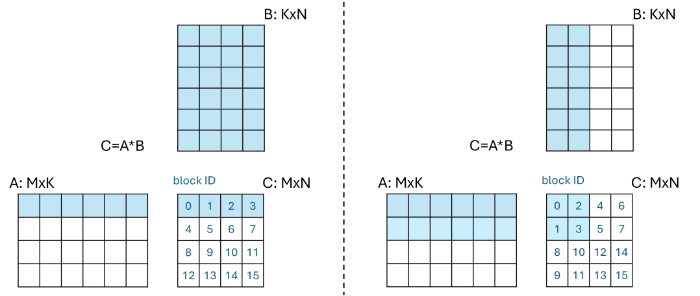
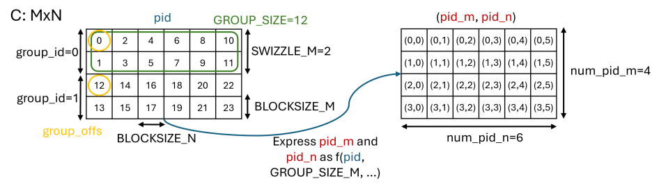
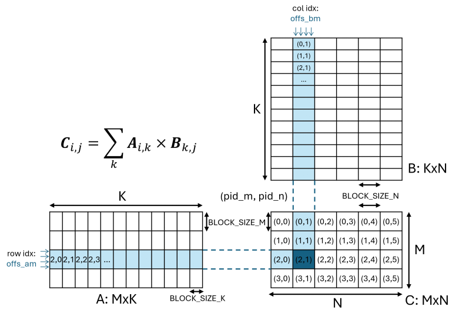

# How Triton Works (A Comparison to CUDA C++) 
Triton is an open-source language and compiler for writing custom GPU kernels directly in Python. You write a ''single-program'' kernel with `triton.jit`, launch it over a grid of program instances (similar to CUDA thread blocks), and Triton compiles it Just-In-Time to highly optimized GPU code.


### Organization (and Distribution) of the Workload in Triton
Let's look at the CUDA C++ [warptiling](../../src/06_sgemm_warptiling.cu) implementation again.
Like CUDA C++, in Triton you must decide how to tile the problem and how many blocks to launch,
but Triton operates at a higher abstraction level.
For a GEMM kernel in Triton, you typically choose:

* Tile sizes: `BLOCK_SIZE_M`, `BLOCK_SIZE_N`, and `BLOCK_SIZE_K`
* Grid size and dimension, e.g.:
`grid = (ceil(M/BLOCK_SIZE_M) * ceil(N/BLOCK_SIZE_N),)`
for a 1D (linearized 2D) grid or
`grid = (ceil(M / BLOCK_SIZE_M), ceil(N / BLOCK_SIZE_N))`
for a 2D grid.
* Number of warps per block: `num_warps`
* The resulting number of threads per block is: `num_warps * 32`
* The depths of the software pipeline over the K-tiles: `num_stages`. This is explained [here](#understanding-num_stages).

Unlike CUDA C++, Triton handles the following tasks for you:

* The distribution of work within a block among the threads/warps 
(which output elements each thread computes), i.e.,
what you manually encoded with warp tiles (`WM`,`WN`) and register tiles (`TM`/`TN`) in the
[warptiling](../../src/06_sgemm_warptiling.cu) kernel.
* Low-level details inside a thread: loop unrolling, FMA loops, tensor-core MMA instructions when applicable, etc.


### Understanding `num_stages`
Consider a block computing one `BM`x`BN` tile of `C` (see [warptiling figure](../../docs/figures/06_warptiling_sgemm.png)).
In a classic CUDA warptiling kernel, each K-slice of A or B (size `BM`x`BK` or `BK`x`BN`) is loaded into shared memory, then used to update the accumulators.

Pseudo code for single-stage execution:

```C++
// Shared memory for the two tiles from A and B
__shared__ float As[BM * BK], Bs[BK * BN];

for (int k=0; k < K; k += BK) {
    // Global memory -> shared memory
    load_tile(As, Bs, k);
    __syncthreads();

    // Compute matmul operation: each thread stores results into tmp registers
    compute_tile(tmp, As, Bs);
  
    // Update result matrix C: C += tmp
    update_C(tmp);
    __syncthreads();
    ...
}
```
This is effectively `num_stages = 1` (load then compute).
`L` stands for `Load` and `C` stands for `Compute`.

| #Stages | k=0     | k=1     | k=2     |
|---------|---------|---------|---------|
| 1       | L0 + C0 | L1 + C1 | L2 + C2 |

A 2-stage pipeline (double-buffering) prefetches the next K-tile while computing on the current one:

```C++
__shared__ float As0[BM * BK], Bs0[BK * BN];
__shared__ float As1[BM * BK], Bs1[BK * BN];

int k = 0;
// Pre-loop: load tiles for k=0 into shared memory
load_tile(As0, Bs0, k);
__syncthreads();

for (; k < K; k += BK) {
    // Prefetch the next tile (k+BK). On Ampere+: using cp.async
    prefetch_tile(As1, Bs1, k + BK);

    // Compute matmul for the current tile (k)
    compute_tile(tmp, As0, Bs0);
    // Update result matrix C: C += tmp
    update_C(tmp);

    // Swap buffers
    swap(As0, As1); swap(Bs0, Bs1);
    __syncthreads();
    ...
}
```

On newer GPUs (Ampere+), the prefetch can be *asynchronous* (`cp.async`), also called *non-blocking*, so loading for `k+BK` overlaps with compute for `k`.
Setting a higher `num_stages` tells Triton's compiler to pipeline the K-loop.
This issues load operations for future tiles early and overlapps them with compute.

| #Stages | Pre-loop | k=0     | k=1     | k=2     |
|---------|----------|---------|---------|---------|
| 1       |          | L0 + C0 | L1 + C1 | L2 + C2 |
| 2       | L0       | L1 + C0 | L2 + C1 | L3 + C2 |
| 3       | L0 + L1  | L2 + C0 | L3 + C1 | L4 + C2 |

More stages lead to a better overlap.
However, this comes at the cost of a higher requirement for registers per thread (for A and B fragment base address, masks, addresses, loop variables, etc.) and a higher requirement for shared memory.
Therefore, too many stages can lead to register spills and reduced occupancy.

A nice explaination of this concept, also called *pipelining*, can be found [here](https://research.colfax-intl.com/cutlass-tutorial-design-of-a-gemm-kerne).

### Occupancy
A warp is considered active from the time its threads begin executing to the time when all threads in the warp have exited from the kernel. There is a maximum number of warps which can be concurrently active on a Streaming Multiprocessor (SM). Occupancy is defined as the ratio of active warps on an SM to the maximum number of active warps supported by the SM. Occupancy varies over time as warps begin and end, and can be different for each SM
[[Source]](https://docs.nvidia.com/gameworks/content/developertools/desktop/analysis/report/cudaexperiments/kernellevel/achievedoccupancy.htm).

The number of warps per SM cannot be chosen directly by the programmer but indirectly by the choice of the workload distribution, register requirements per thread (register file is shared among all active threads on an SM), shared memory per block etc.
For memory-bound applications, it is nice to have a high occupancy to hide the load/store latency effectively.
For compute-bound applications, a high occupancy is not so important (sometimes even bad [[Source]](https://www.nvidia.com/content/gtc-2010/pdfs/2238_gtc2010.pdf)) because a smaller number of warps per SM can already utilize the ALU pipelines.


### L2-Cache Reuse using Thread-Group ID Swizzling

When we take a look at the kernel launch in [gemm_kernel.py](src/gemm_kernel.py), we see that a 1D grid is created.
After that, the so-called program IDs (`pid`) are used to calculate the block indices in a 2D grid (`pid_m`, `pid_n`):

```Python
grid = lambda META: ( \
    triton.cdiv(M, META['BLOCK_SIZE_M']) * triton.cdiv(N, META['BLOCK_SIZE_N']), )
```

The variables `pid_m` and `pid_n` are then used to calculate the addresses inside the matrices `A`, `B`, and `C`.
Now, one might ask, why don't we launch the kernel like this:

```Python
grid = lambda META: ( \
    triton.cdiv(M, META['BLOCK_SIZE_M']), triton.cdiv(N, META['BLOCK_SIZE_N']), )
```

In that 2D case, we could directly access `pid_m` and `pid_n` inside the kernel.
However, with the 1D launch we instead have to determine them using some calculations that are shown below:

```Python
num_pid_m = tl.cdiv(M, BLOCK_SIZE_M)
num_pid_n = tl.cdiv(N, BLOCK_SIZE_N)
GROUP_SIZE = SWIZZLE_N * num_pid_n
group_id = pid // GROUP_SIZE
group_offs = SWIZZLE_N * group_id
pid_m = (pid % SWIZZLE_N) + group_offs
group_size_m = min(num_pid_m - group_offs, SWIZZLE_N)
pid_n = (pid % GROUP_SIZE) // group_size_m
```

The reason why we don't launch the 2D grid directly is that we want to optimize L2 cache reuse.
In contrast to the L1 cache, which is only per-SM, the L2 cache is global and shared by all SMs.
When multiple blocks load or store the same or adjacent data from/to `A` and `B`, that data is likely still in the L2 cache.
Let's look at the launch order of the blocks in the matrix-matrix multiplication `A × B = C`:

<p align="center">
  
</p>

Assume blocks 0–3 are executed around the same time.
When we launch them row-wise, we get a lot of reuse along `A` but little reuse along `B`. Cache misses for `B` are likely to occur.
To also improve the likelihood of cache hits in `B`, we can use the assignment on the right-hand side.
This is called *threadblock swizzling*, here `swizzle = 2`.
You can swizzle along `N` or `M`.
Swizzling means creating a mapping from `blockIdx → (pid_m, pid_n)` in a zig-zag order.
As a result, adjacent tiles (adjacent block IDs) are closer together in space and time.

It is important to note that swizzling is not limited to 1D launches.
You can just as well launch a 2D grid and then remap the 2D coordinates to other 2D coordinates to achieve the same effect.

More sources:

* [Thread-group ID swizzling](https://developer.nvidia.com/blog/optimizing-compute-shaders-for-l2-locality-using-thread-group-id-swizzling)
* [Persistent Kernels and Stream-K](https://research.colfax-intl.com/cutlass-tutorial-persistent-kernels-and-stream-k)

To implement this (i.e., to get the code snippet shown above), we need to think about the following translation problem:

<p align="center">
  
</p>

On the left side, we can see the desired block dispatch order.
On the right side, we have a normal 2D grid.
`SWIZZLE_N` is an optimization parameter.
It is important to note that we cannot guarantee that the blocks are dispatched in the order of their IDs, i.e., 0 → 1 → 2 → 3 …
NVIDIA specifies that blocks must be independent. This means, in principle, they can be executed in any order.
However, this concept still brings performance improvements because it has been empirically observed that the block dispatcher frequently schedules blocks from roughly ascending ID ranges (though this is not guaranteed) [[source](https://forums.developer.nvidia.com/t/what-is-the-execution-order-of-cuda-blocks/298502)].


### Implement the Core Functiionality
Instead of programming what a single thread does (as in CUDA C++), in Triton, you program what the entire tile does and express its work with matrix-style operations.

As shown in [gemm_kernel.py](src/gemm_kernel.py):
1. Build index grids (`offs_am`, `offs_bn`, `offs_k`) and pointer matrices for A and B.
1. `tl.load` the A and B tile blocks.
1. Compute with `tl.dot`, accumulating into the tile-sized `accumulator`.
1. Form the pointer matrix for C and `tl.store` the results.

Masks can be used for all edge cases, i.e., all values at the tensors boundaries that do not fit perfectly in a tile.
The overall process is quite similar to the [tiled_2d](../../src/03_sgemm_tiled_2d.cu) kernel:

<p align="center">
  
</p>
