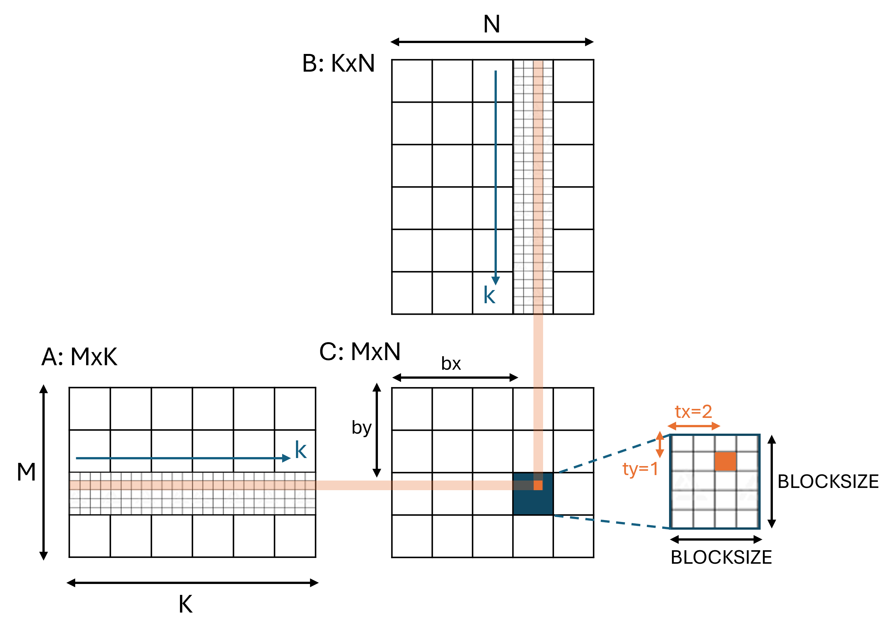
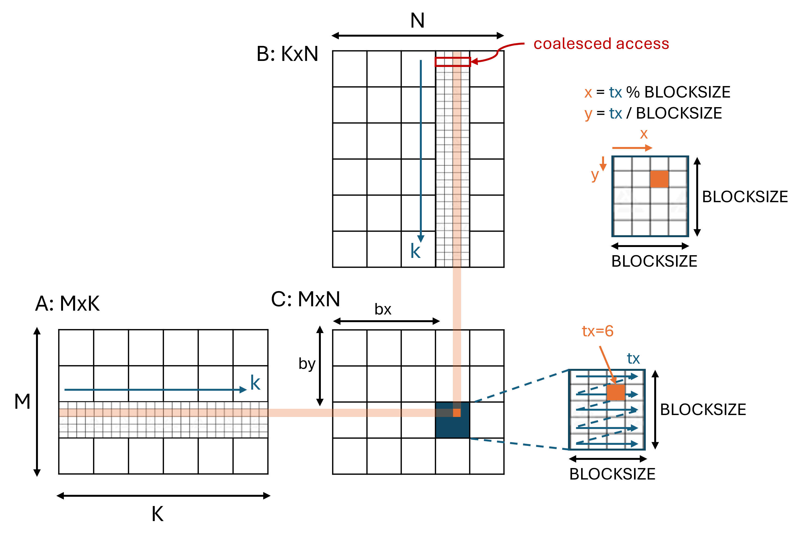
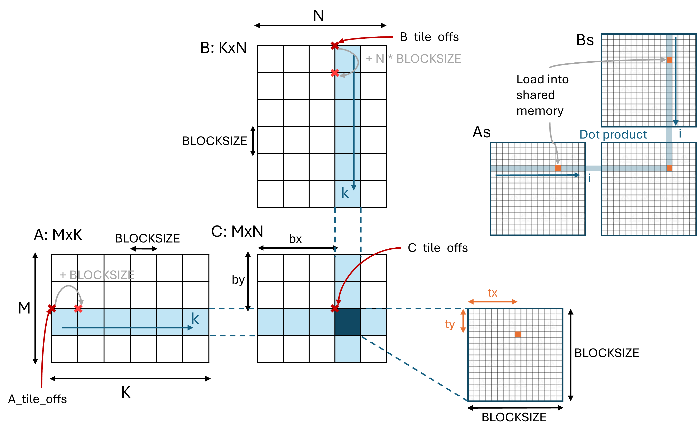
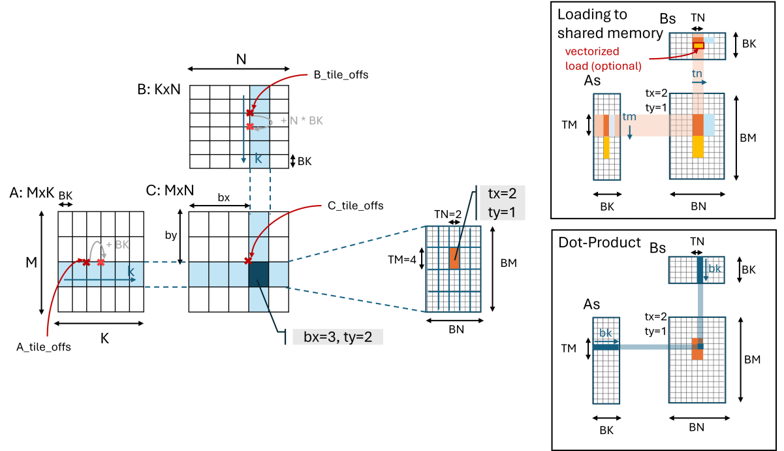

# Writing CUDA Kernels - A VSCode Setup
This repository is designed to simplify your introduction to CUDA kernel development by providing a ready-to-use VSCode setup. With it, you can both profile your kernels and debug them directly from the VSCode editor, so you can dive into online tutorials immediately without wrestling with your toolchain first.
- Build system: [CMake](CMakeLists.txt)
- Example kernels: simple GEMM operations, inspired by the tutorials from [siboehm](https://siboehm.com/articles/22/CUDA-MMM) and [leimao](https://leimao.github.io/article/CUDA-Matrix-Multiplication-Optimization/).


## Build sgemm kernels in VSCode

1. Make sure you have all necessary VSCode extensions: 
    - C/C++ & C/C++ Extension Pack
    - CMake & CMake Tools
    - (Kernel profiling) Nsight Visual Studio Code Edition
    - (For style formatting only) Clang-format
    - (If Python is used) Python & Python Extension Pack

1. Adapt the `CUDA_PATH` variable in the [settings.json](.vscode/settings.json) file.

1. Select the build variant (Release or Debug): (F1) -> (CMake: Select Variant)

1. Configure + Build + Install the executable: (F1) -> (CMake: Install)

1. You should now be able to see the binary called `sgemm` in the [build](build/debug/bin/sgemm) or [release](build/release/bin/sgemm) folder depending on the variant.


## Run and debug kernels in VSCode
The run and debug configurations can be found in the [launch.json](.vscode/launch.json) file.

To just run the kernel (release version), select:

- (F1) -> (Debug: Select and Start Debugging) -> (Run kernel)

To set breakpoints in VSCode to debug the host code and/or the GPU code, select:

- (F1) -> (Debug: Select and Start Debugging) -> (Debug kernel)


## Profile the kernels in VSCode
To collect meaningful performance metrics, you should always profile the **release** version of your kernel.

By default, NVIDIA’s profiler (`ncu`) requires **elevated (root)** privileges to access GPU performance counters.

To allow all users to run `ncu` without invoking `sudo`, NVIDIA describes a permanent, non-root workaround
[here](https://developer.nvidia.com/nvidia-development-tools-solutions-err_nvgpuctrperm-permission-issue-performance-counters).

1. Follow the steps on the website if you wish to continue without sudo.

1. (F1) -> (Tasks: Run task) -> (Profile SGEMM with Nsight {sudo/ no sudo})

1. Enter the kernel name, e.g., `sgemm_simple`

1. Select the section you want to profile.

1. Enter the sudo password in the terminal in VSCode.


## Build sgemm kernels in terminal
```bash
mkdir -p build/debug/build && cd build/debug/build
cmake \
    -DCMAKE_BUILD_TYPE={Debug/Release} \
    -DCMAKE_INSTALL_PREFIX=../ \
    -DCMAKE_CUDA_TOOLKIT_ROOT_DIR=<CUDA_PATH, e.g.: `/usr/local/cuda-12.4`> \
    ../../../
make
make install

# Execute in main directory
./build/{debug/release}/bin/sgemm

# Show instructions
${CUDA_PATH}/bin/cuobjdump --dump-ptx build/{debug/release}/bin/sgemm
```

## Implementations included
The following sgemm implementations are included in this repository:
____
### Simple sgemm
<p align="center">
  
</p>

____
### Coalesced sgemm
<p align="center">
  
</p>

____
### Tiled sgemm
<p align="center">
  
</p>

____
### 2D-Tiled sgemm & 2D-Tiled sgemm (vectorized v2)
<p align="center">
  
</p>

____
### 2D-Tiled sgemm (vectorized v1)
<p align="center">
  
</p>
